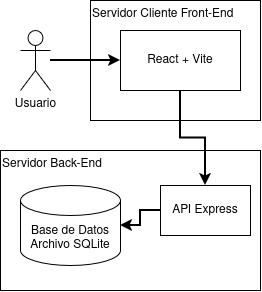

# PASO — Vitrina de productos

[SPECIFICATION.md](https://github.com/tareasmiranda/nttdata-fullstack/blob/main/docs/SPECIFICATION.md) | [ARCHITECTURE.md](https://github.com//nttdata-fullstack/blob/main/docs/ARCHITECTURE.md) | [AI-WORKFLOW.md](https://github.com/tareasmiranda/nttdata-fullstack/blob/main/docs/AI-WORKFLOW.md)

Aplicación web full stack que muestra un catálogo de supermercado de ~4.000 productos almacenados en SQLite. Permite buscar por nombre, filtrar por categoría o formato, navegar por páginas de 12 resultados y abrir el detalle de cada producto. El frontend nunca descarga el catálogo completo: la búsqueda, el filtrado y la paginación se resuelven en el backend.

Stack: **React + Vite** (frontend) · **Node.js + Express** (API) · **SQLite**.



## Inicio rápido

Requisitos: Node.js 20+, npm 10+ (con `allowScripts` disponible; npm 12 lo trae por defecto).

```bash
# 1. Instalar dependencias de la raíz, el servidor y el cliente
npm install
npm run install:all

# 2. Arrancar API y frontend a la vez
npm run dev
```

Con eso quedan disponibles:

- Frontend: http://localhost:5173
- API: http://localhost:3000/api/products

### Arranque por separado

```bash
# Terminal 1
cd server && npm run dev      # → http://localhost:3000

# Terminal 2
cd client && npm run dev      # → http://localhost:5173
```

El proxy de Vite en `client/vite.config.js` redirige `/api/*` a `http://localhost:3000`, así que ambos modos funcionan igual.

## Estructura

```
nttdata-fullstack/
├── package.json
├── server/
│   ├── index.js
│   ├── catalog.sqlite
│   └── images/
└── client/
    ├── vite.config.js
    └── src/
        ├── App.jsx
        ├── ProductDialog.jsx
        ├── api.js
        ├── utils.js
        └── styles.css
```

## Endpoints

| Método | Ruta | Descripción |
| --- | --- | --- |
| GET | `/api/products?page=&pageSize=&q=&category=&format=` | Página de productos con búsqueda y filtros aplicados en el servidor. Devuelve `{ items, total, page, pageSize, totalPages }`. |
| GET | `/api/products/:id` | Detalle de un producto por ID (la tabla usa `INTEGER PRIMARY KEY`). |
| GET | `/api/products/filters` | Valores distintos de categoría y formato para poblar los `<select>`. Devuelve `{ categories, formats }`. |
| GET | `/api/products/by-ids?ids=1,2,3` | Productos por lista de IDs (usado internamente para el detalle cacheado). |
| GET | `/api/health` | Healthcheck. |

## Verificación

Vease [AI-WORKFLOW.md @ Verificación](https://github.com/tareasmiranda/nttdata-fullstack/blob/main/docs/AI-WORKFLOW.md#3)
